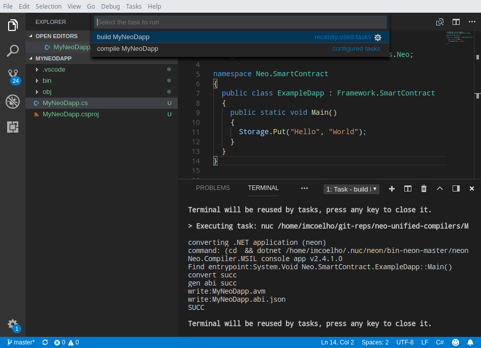

# neo-unified-compilers
## NUC: Compilers for Neo Blockchain

### How to install

Install dotnet-sdk (currently dotnet core 2.2 for linux).

Recommended: install VS Code (project is automatically generated on this format)

To install on linux: `./linux_install.sh` (no need for root user! perhaps will need `chmod +x linux_install.sh`)

### Easily creating a C# Smart Contract

Simply run command: `nuc dapp MyNeoDapp.cs`

Folder `MyNeoDapp` will be generated (together with VSCode build commands).

If you open MyNeoDapp folder on VS Code, go to "Tasks" menu and execute the "build MyNeoDapp" action.
It will generate `MyNeoDapp.nvm` (or `MyNeoDapp.avm`).

You can translate it to hex format and verify if it's correct: `nuc hex MyNeoDapp/bin/Release/netcoreapp2.0/MyNeoDapp.avm`.
Output should be `00c56b0548656c6c6f05576f726c64617c68048418d60d680452a141f5616c7566` which is the Hello World example ;)

Have fun!

_Thanks to @hugbro for the many advices that helped us made this possible._

Copyleft 2019

NeoResearch Community
